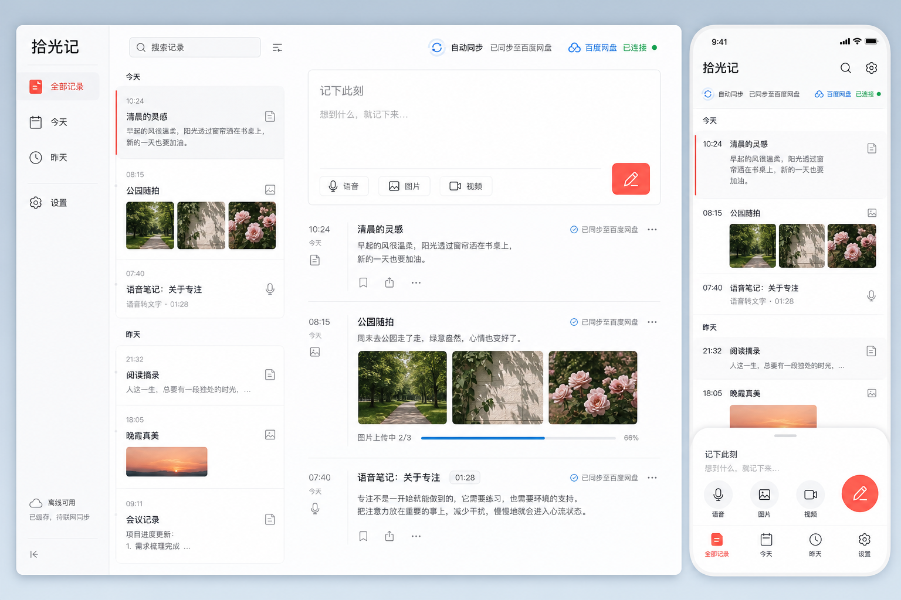

# 拾光记

一个手机和电脑都能用的离线优先备忘录。文字、图片和视频会先安全保存在当前设备，连接百度网盘后自动上传；每次打开应用都会拉取云端清单并按更新时间合并。

除网页/PWA 外，项目现在还包含 Android、iOS 与 Electron 原生应用壳。应用安装后从桌面图标启动，内部复用同一套网页界面；详见[原生应用构建说明](docs/NATIVE_APPS.md)。



## 已实现

- 响应式桌面端与手机端界面，支持安装为 PWA
- Android/iOS Capacitor 应用与 Windows/macOS/Linux Electron 应用
- 文字记录、图片附件、视频附件与本地预览
- 中文语音转文字（手机应用使用原生系统识别，网页/桌面使用 Web Speech API）
- IndexedDB 离线存储，断网可记、联网后补传
- 新内容自动同步，启动时自动检查更新
- 百度 OAuth 2.0 授权、刷新令牌、加密 HttpOnly Cookie
- 百度网盘 4 MB 分片上传、云端清单合并和附件回读
- 同一条记录以 `updatedAt` 较新版本为准，删除也会同步为墓碑记录

## 本地运行

要求 Node.js 20 以上。

```bash
npm install
copy .env.example .env
npm run dev
```

打开 <http://localhost:5173>。不配置百度网盘也可以完整使用本地记录、附件和语音输入。

生产构建：

```bash
npm run build
npm start
```

生产服务默认运行在 <http://localhost:8787>，同时提供前端静态文件和 `/api` 接口。

## 原生应用

```bash
# Windows/macOS/Linux 开发壳
npm run desktop:dev

# 当前电脑平台安装包
npm run desktop:dist

# 同步 Android/iOS 原生工程
npm run mobile:sync
```

原生安装包必须通过 `VITE_API_BASE_URL` 指向已部署的 HTTPS 后端，才能使用百度网盘同步。未配置时本地离线记录仍然可用。完整步骤见 [docs/NATIVE_APPS.md](docs/NATIVE_APPS.md)。

## 连接百度网盘

1. 前往[百度网盘开放平台](https://yun.baidu.com/union)申请接入并创建软件应用。
2. 在应用中登记回调地址；本地开发使用 `http://localhost:8787/api/auth/baidu/callback`。
3. 复制 `.env.example` 为 `.env`，填写 `BAIDU_APP_KEY`、`BAIDU_SECRET_KEY` 和 `APP_SECRET`。
4. 将 `BAIDU_REMOTE_DIR` 改为开放平台分配或允许访问的应用目录。它不是任意网盘目录。
5. 重启服务，在“设置 → 连接百度网盘”完成授权。

百度开放平台的开发者资格和应用审核规则可能调整；正式上线前请以控制台当前要求为准。上传实现遵循官方最新 SDK 所示的“预创建 → 分片上传 → 创建文件”流程。

### 生产环境变量

```dotenv
BAIDU_APP_KEY=你的AppKey
BAIDU_SECRET_KEY=你的SecretKey
BAIDU_REDIRECT_URI=https://你的域名/api/auth/baidu/callback
BAIDU_REMOTE_DIR=/apps/开放平台分配的应用目录
APP_SECRET=至少32字节的随机字符串
APP_ORIGIN=
PORT=8787
MAX_UPLOAD_MB=512
NODE_ENV=production
```

生产环境必须启用 HTTPS，确保 OAuth Cookie 以 `Secure` 模式传输。

## 数据与同步结构

```text
浏览器 IndexedDB
├── notes             记录元数据与同步状态
├── blobs             图片/视频二进制
└── meta              最近同步时间

百度网盘应用目录
├── .shiguang-manifest-v1.json
└── shiguang-{noteId}-{attachmentId}.{ext}
```

本地保存永远先于网络同步。打开应用或网络恢复时，会拉取云端 manifest、按记录 ID 和更新时间合并、上传缺失附件，再覆盖写入新的 manifest。OAuth token 使用服务端 `APP_SECRET` 通过 AES-256-GCM 加密后存入 HttpOnly Cookie，前端 JavaScript 无法读取。

## 浏览器兼容性

- Chrome / Edge：支持语音输入、图片、视频和 PWA。
- Safari / iOS Safari：支持带 `webkitSpeechRecognition` 的系统版本；首次语音输入会请求麦克风权限。
- 不支持 Web Speech API 的浏览器仍可使用其他全部功能，并会显示明确提示。

## 验证

```bash
npm run typecheck
npm test
npm run build
```

项目已在 1440×1000 桌面视口和 390×844 手机视口完成真实浏览器验收，包括文字与图片记录、刷新后持久化、手机端编辑面板、设置状态和控制台错误检查。

## 部署同步后端

原生安装包要连接百度网盘，必须先有一个公网 HTTPS 后端。可用 Docker：

```bash
cp .env.example .env
# 填写百度开放平台凭证和 APP_SECRET
docker compose up -d --build
```

然后在反向代理上启用 HTTPS，把百度回调设为 `https://你的域名/api/auth/baidu/callback`，并在 GitHub Actions 仓库 Secrets 中设置 `MOMENT_API_URL`。完整步骤见 [docs/NATIVE_APPS.md](docs/NATIVE_APPS.md)。
